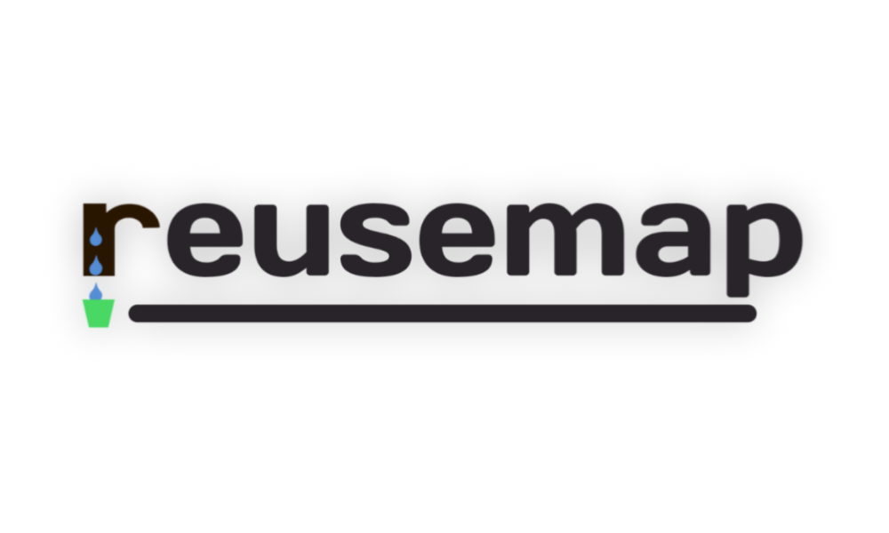

# naamuib Inc.

리유스맵 - 가까운 거리의 실천

총  괄 : 김기훈,김예빈   
   
엔지니어링 : 김기훈   
정보 구성 : 김예빈   
데이터베이스 : 김기훈   
일반 데이터 : 김예빈   
웹 디자인 : 김기훈   
API_MAP : 김기훈   
문자열 감지 : 김기훈   
도형코드 인식 : 김기훈   
조사성 정보 : 김예빈   
그래픽 아트 : 김예빈   
jQuery : 김기훈   
안드로이드 연동 :    
iOS 연동 :   
정보제공 오픈 : 서울시   
         

앞으로의 계획 :   
   
GPS_MYLOCATION 구현 (완료)  
바코드 인식 구현   
개발자 노트 구현   
위치 반경 구현   
쓸생일지 구현   
리워드 및 아트 구현   
안드로이드 앱 개발 시작
데이터 연동하기   
맥북을 구매하기   
이제iOS앱 개발 시작   
구글 플레이와 앱스토어 출시   
서비스 시작   
브랜드 등록   
시가총액 1억 돌파 유니콘되기  

